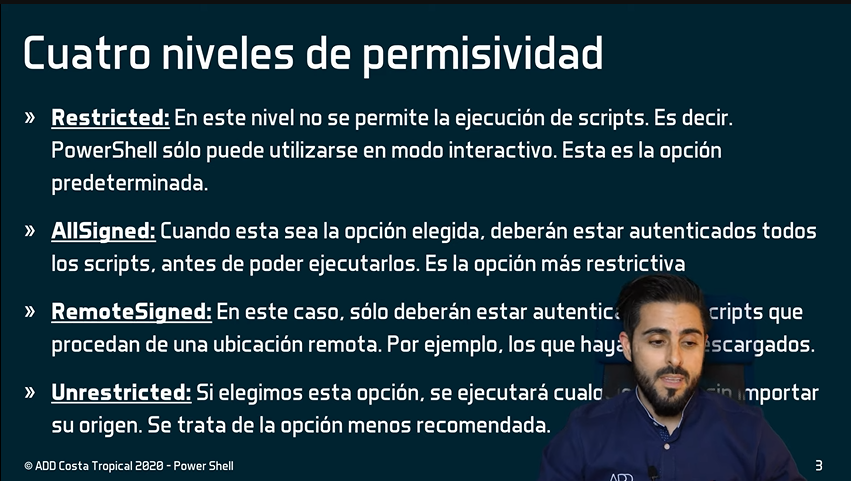

# ¿Que es PowerShell?
Es un lengaje de programación de Scripting en Windows, nos permite interacturar  hacer casi cualquier cosa dentro del sistema operativo.

- Fue lanzado en 2006
- Permite crear Scripts que no sean archivos por lotes como los .BAT
- Maneja una estructura similar a la de PERL
- Comenzo llamandose 'monas'
- Requiere NET Framework
- En 2016 Microsoft publico en GitHub el codigo fuente de PowerShell

## Ejecución de Scripts



Obtener el tipo de Politicas de ejecución que tenemos ```Get-ExecutionPolicy``` y para cambiar la politica de seguridad que solo permite ejectar scripts coo administardor firmado ```Set-ExecutionPolicy RemoteSigned```

## Cmdlet Utiles 

#### Actualizar la ayuda de powershell

`Update-Help`

#### Obetener ayuda de un comando en especifico

Para obtener ayuda de un comando en especifico debemos utilizar la siguiente sintaxis **Get-Help Get-Cmdlet** y le podemos pasar los parametros **-Examples -Detailed -Full -Online** por ejemplo:

```
Get-Help Get-ChildItem -Online
Get-Help Copy-Item -Examples
```

## Variables

Podemos definir las variables de 2 formas una implícita y otra explícita.

- La variables no se deben definir con caracteres especiales.
- Deben ser entendible el nombre que les coloquemos.
- para sefinir una variable debemos ante poner un **$** + Nombre = Valor.


**Forma Implicita**

`$nombre = "Fabian Andres"`

**Forma Explicita**

```
New-Variable $nombre
New-Variable -Name $nombre
New-Variable -Name $nombre -Value 'Fabian Andres'
```

## Constantes

La costantes al contrario de las variables tienen que definirse de forma explícita

`New-Variable -Name $nombre -Value 'Fabian Andres' -Option RadHonly`

### Leer y escribir datos por pantalla

**Read-Host** nos permite capturar datos por pantalla por ejemplo `$nombre = Read-Host "Por favor digite su nombre" `
**Write-Host** nos permite mostrar por pantalla el valor de una variable por ejemplo `$nombre = Write-Host "Hola $nombre" `

## Tipos de Datos / Variables


Para obetener el tipo de variable es si un Int, Char, Booleano etc.

```
$nombre = "Fabian Andres"
Write-Host $nombre.GetType().name
```

### Operadores aritmeticos

Los operadores aritmeticos utilizados en PowerShell son los mismos que en otros lenguajes de programación.

```
Prioridad 	Operador 	    Descripción
1 	        () 	            Paréntesis
2 	        - 	            Para un número negativo o un operador unario
3 	        *, /, % 	    Para multiplicación y división
4 	        +, - 	        Para suma y resta
5 	        -band, -bnot 	Para las operaciones bit a bit
5 	        -bor, -bxor 	Para las operaciones bit a bit
5 	        -shr, -shl 	    Para las operaciones bit a bit
```

**Ejemplos**

Operaciones con suma, resta, multiplicación y división.

```
3+6/3*4    # result = 11
3+6/(3*4)  # result = 3.5
(3+6)/3*4  # result = 12
```

Redondear un numero entero al mas cercano.

```
[int]( 5 / 2 )  # Result is rounded down
2
[int]( 7 / 2 )  # Result is rounded up
4
```

Con la clase Math podemos realizar el rodendo de las variables, segun lo que le parametrizamos.

```
[int][Math]::Round(5 / 2,[MidpointRounding]::AwayFromZero)
3
[int][Math]::Ceiling(5 / 2)
3
[int][Math]::Floor(5 / 2)
2
```

Más operadores en [Microsof Learning](https://learn.microsoft.com/es-es/powershell/module/microsoft.powershell.core/about/about_arithmetic_operators?view=powershell-7.3)

### Operadores + con String

Se peuden sumar cadenas de caracteres por medio del operador +

```
$FirstName = "Fabian"
$LastName = "Feria"
$FullName = $FirstName + $LastName
```

### Operadores += -= *= /=

Forma abreviada para no repetir el valor actual de la variable y modificar su valor.

```
$n = 2 
$n = $n + 5
```

Forma abreviada

```
$n = 2 
$n += 5
```


By: **Fabian Feria**